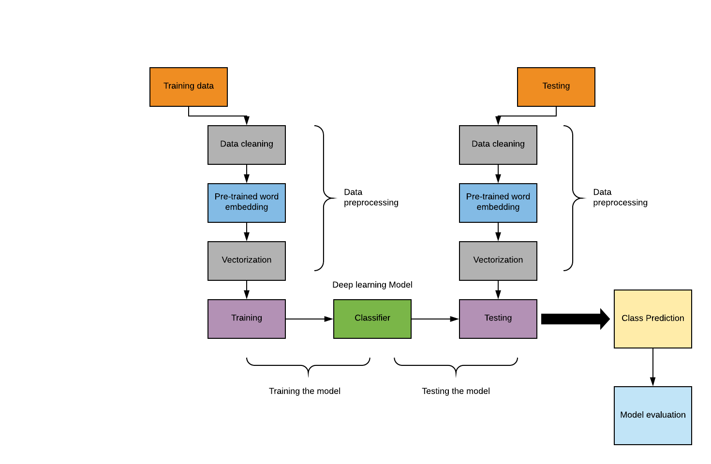

# Textual Entailment and relatedness score

 In this project, deep learning models are used to predict the directional relation between 2 sentences, the possible relations are 'Entailment', 'Neutral', and 'Contradiction'. The data set used for the study is the SICK data set which can be downloaded from 'http://marcobaroni.org/composes/sick.html'.

 ### Methods
  <ul>
    <li>Bidirectional LSTM</li>
    <li>Siamese LSTM</li>
    <li>Siamese CNN</li>
    <li>GRU</li>
    <li>Deep RNN</li>
  </ul>
 <p></p>

The highest accuracy was achieved using siamese LSTM for both entailment and relatedness task are as follows:
<ul>
    <li>Entailment Task: 84%</li>
    <li>relatedness Task: 81%</li>
</ul>

### Prerequisites
Python version 3.7.7 was used for development.<br>
Python Packages required can be found in <i>'requirement.txt'</i><br>
The packages can be installed using the command:
```
pip install 'package_name'
```

#### Word embedding
Glove.6b.50d.txt word embedding file is used assigning weights in embedding layer for all deep learning tasks.
1. Instructions to download the word embedding file is given inside word embedding folder, download the word embedding file following the instruction and keep the glove.6b.50d.txt file inside the word embedding folder.
